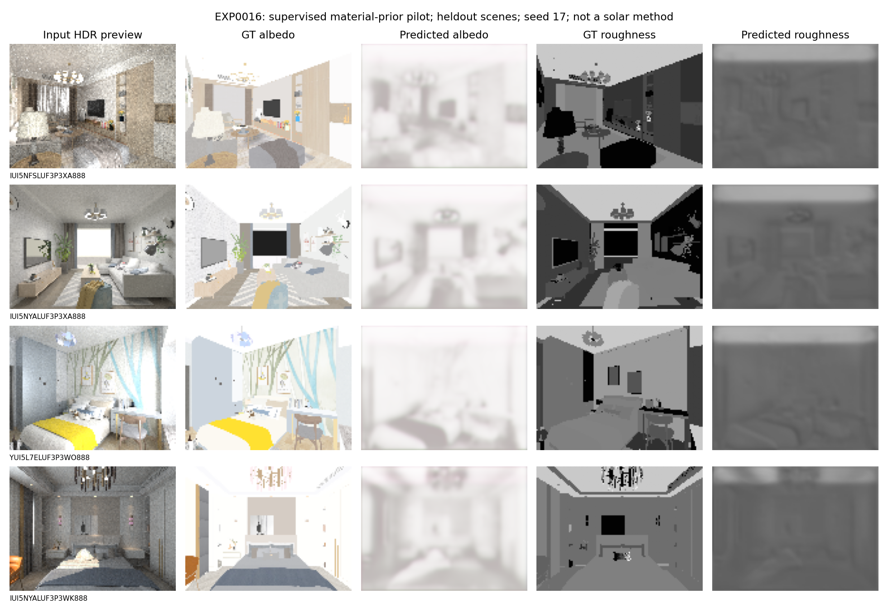

# EXP0016：InteriorVerse 材质先验初步训练

2026-09-20。目的：检验现有数据能否支持监督材质训练，并建立可追溯的训练/验证/评分流程。
这不是显式太阳方法、IRIS 比较或多视角重建实验。

## 固定设置

`part_0.zip` 共 100 房间、998 视角。按官方房间划分：
82/14/4 个 train/val/test 房间，对应 840/111/47 张照片，无房间交叉。
输入仅 HDR RGB；真值材质只用于监督训练和独立评分，深度/法线没有输入网络。

小型三层编码器—解码器，128×96，8 epochs，batch16，Adam lr0.001。
固定 seed 17/23/41；按验证房间宏平均 MSE 选择 checkpoint，再评估测试。
各 seed 选择 epoch 7/8/8，没有从测试分数挑选最佳 seed。
训练缓存用 float16（训练转 float32），作为轻量可行性实验记录，非高精度最终测量设置。
所有有效像素材质标签均通过数值/范围检查，没有因此排除有效标签像素。

## 结果

先每视角计算有效像素 MSE，再在每房间汇总，最后对房间等权平均。
下表网络结果为三种子的均值，括号为种子间样本标准差；它不是跨房间置信区间。

| 材质 | 训练像素常量均值基线 | 网络 | 相对 MSE 降幅 |
|---|---:|---:|---:|
| 反照率 | 0.053580 | 0.037817（0.000677） | 29.4% |
| 粗糙度 | 0.066199 | 0.057663（0.000823） | 12.9% |
| 金属度 | 0.022792 | 0.022862（0.000693） | -0.3% |

这是很弱的常量对照，不能等同于优于 IRIS、SIR 或成熟材质估计网络。
只有 4 个测试房间，不能据此推广到整个数据集。

## 视觉检查与决定

固定第一种子、每个测试房间首张图输出对照，没有挑最好看的结果。
预测反照率明显偏白、过度平滑，粗糙度缺少物体边界；金属度均值也未改善。
**决定：训练流程通过，先验质量未通过；不直接作为主太阳方法的初始化。**

下一个先验实验只在训练/验证集比较更成熟的初始化和保真损失；
当前 4 个已查看测试房间按探索性测试处理，最终结论必须使用新冻结的独立场景。
不为让该结果显得更好而继续在同一测试集上选模型或参数。

太阳约束主方法另行推进；不能用本实验的误差下降支持太阳几何有效的结论。

## 自动运行与证据

```bash
python experiments/watch_research_run.py \
  --record experiments/out/EXP0016_material_prior/job_01 \
  --max-seconds 1800 --idle-seconds 300 -- \
  python -u experiments/train_interiorverse_prior.py
python experiments/report_material_prior.py
```

重跑须使用新的输出目录；默认旧目录存在时拒绝覆盖。
本次监督器记录完整运行成功，约 44 秒（含缓存准备）；模型训练计时另见 results.json。
监控器成功/超时终止测试与既有测试共 17 项通过。
证据在 `research/evidence/EXP0016/`，权重仅存在本地输出目录，不提交 Git。


