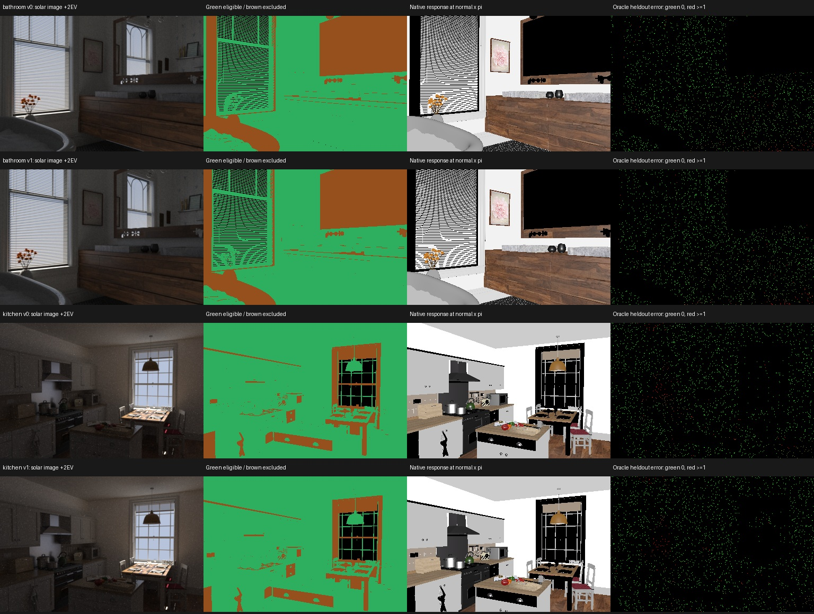

# EXP0018：原生材质响应真值与 IRIS 兼容性诊断

## 为什么先做这个

浴室和厨房的原始材质含 diffuse、plastic、roughplastic、conductor、
roughconductor、镜面、bumpmap 和透明包装层。IRIS 使用自己的
metallic-roughness 模型（Schlick Fresnel 与近似遮蔽函数）。
相同名称的参数不是相同的反射函数，不能直接把 alpha 当作 IRIS roughness。

本实验直接调用原场景 Mitsuba BSDF 导出角度响应，再调用仓库原版
`model/brdf.py:BaseBRDF.eval_brdf` 拟合这些响应。这是使用真值的诊断，
不是从照片估计，不是太阳方法，也不构成材料恢复精度提升。

## 真值定义

最终 `run_04`：两个房间各两视角，384×256 像素中心射线。
保存有效性、第一交点、深度、着色法线、局部相机方向、UV、合并后的 shape ID、
BSDF flags 与 25 个方向的原生响应。方向为法线方向和极角 20/40/60°、
方位每 45° 一次。响应是 BSDF × 该方向余弦，不是 albedo 图。
生成真值只放生成端，不加入上一轮 estimator_inputs。

连续响应不能表达 delta 镜面质量；含 delta/null 的像素和掠射/背面相机方向
从本轮拟合排除。浴室约 23% 全图像素含 delta 分量，不能以零连续响应判为黑色材质。
原生 bumpmap 内部改变法线，而本轮 IRIS 使用交点着色法线；这也是模型差异的一部分。
透明表面只取第一几何交点；没有对透明路径进行随机采样。

## 诊断设计

每视角固定随机取 2048 个合格像素，每像素独立拟合 5 个参数。
13 个拟合方向覆盖四个方位；另外 12 个中间方位只作验证。
3 次初始化，每次 400 Adam 步；仅按拟合方向的损失逐像素选解，验证不参与选解。
损失按每像素拟合方向 RMS 归一化，分母至少 0.01；参数 sigmoid 约束，
roughness 在 [0.02,1] 内。报告原始响应 RMSE、整体相对 RMSE、逐像素相对误差中位数/P90。
样本是探索性选取，没有独立房间统计检验。

增加同模型对照：用原版 IRIS 在相同相机/方向生成已知随机材质响应，
再用相同优化程序拟合。用于发现方向覆盖、优化和参数歧义问题。
该对照与原生材质分布不同，不能直接相减得到模型误差。

## 保留的失败与修正

- `run_01`：NumPy float64 不能直接构造 Mitsuba Vector3f，显式转 float 后修复。
- `run_02`：成功但未保存局部相机方向，`run_03` 补齐。
- `fit_01` / `control_01`：9 个响应方向中，拟合仅覆盖单一方位平面。
  同模型对照换方向也明显失准；不能把它归因于原生模型不匹配。
- `control_02`：稀疏方向增加至 2000 步，用来检查仅增加优化步数是否解决。
- `run_04`：改为 25 个方向，拟合覆盖四方位。
- `fit_02`：方向数量变量与材质键重名导致异常；修复后运行 `fit_03`。

## 文件与边界

生成与拟合原始数据位于 `experiments/out/EXP0018_native_brdf/`。
每次运行独立目录与源码快照，拟合有 300 秒运行上限和 90 秒无日志上限。
本实验没有执行 IRIS 全流程训练，也没有解决此前 stage10 停滞。
有限角度、有限步数拟合误差不是已证明的理论下界。
后续主实验仍需匹配 BRDF 的受控分支；原始多材质场景保留作模型失配压力测试。

场景署名：Bathroom by Mareck（CC0）；Country Kitchen by Jay-Artist（CC BY 3.0）；
由 Benedikt Bitterli 整理，https://noobody.org/resources/ 。

## 最终结果（25 个方向，400 步）

| 场景/视角 | 原生材质中位相对误差 | 原生材质 P90 | 同模型中位相对误差 | 同模型整体相对 RMSE |
|---|---:|---:|---:|---:|
| bathroom / 0 | 2.36% | 37.95% | 0.32% | 75.80% |
| bathroom / 1 | 2.16% | 35.00% | 0.34% | 40.20% |
| kitchen / 0 | 1.99% | 37.62% | 0.36% | 30.11% |
| kitchen / 1 | 2.03% | 34.87% | 0.36% | 68.68% |

**验收未通过。** 同模型对照多数像素误差较小，但少数尖锐高光主导整体误差；
因此不能把原生拟合误差直接当作模型不兼容的证据，也不能把当前拟合参数作为材质 GT。
方向增多后指标不是严格的前后对比：验证方向集合已变化。
稀疏 9 方向增加到 2000 步也未彻底解决；需要围绕反射峰自适应采样、
更充分的优化与同模型参数恢复检查。原生材质与随机对照分布不同，不能直接相减。

朗伯解析响应检查通过（reflectance × cos / pi），脚本编译与有界任务成功。
导出是真值记录；拟合是未通过的评估准备，二者不能混为“完成 BRDF 恢复”。

图第三列为指定方向响应 × pi 的显示，并非 albedo；末列只显示抽样评分点，
黑色是未评分像素，不能解读为零误差。
