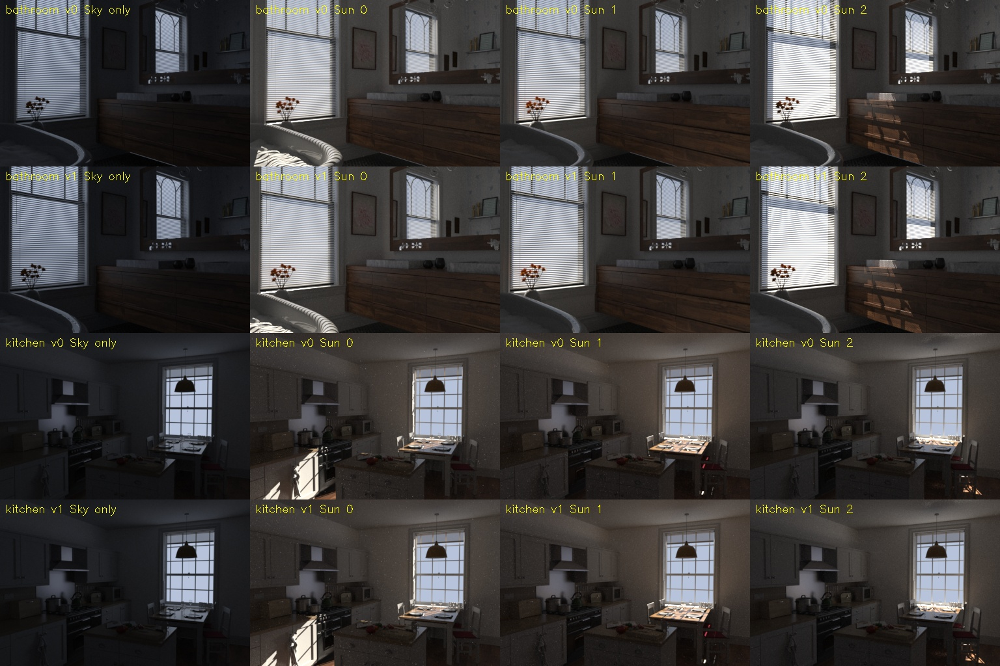

# EXP0017：完整材质场景的太阳重渲染试验

2026-09-20。用户要求自动尝试，已实际运行生成、检查、修正、重跑和输入导出。
这是生成端试验，不是逆渲染算法比较，也不是实拍场景或 sim-to-real 结果。

## 完成内容

使用完整的 Contemporary Bathroom（Mareck，CC0）和 Country Kitchen
（Jay-Artist，CC BY 3.0），经 Benedikt Bitterli 整理为 Mitsuba 场景。
原模型、纹理、粗糙塑料/导体/镜面等 BSDF 保持不变。
移除原有代理面光源的矩形几何，以显式外部太阳与天空代替；所有修改保存在 XML。

每场景 2 个相机、3 个太阳方向、2 个随机种子：24 张日光 HDR。
另有每场景/相机的仅天空控制图，共 4 张。
太阳相对主开口方位为 -20/0/+20°，高度角为 25/40/55°；
方向是人为指定的已知模拟条件，不是实际地点/时刻的星历。
384×256，最多 12 次路径深度，固定曝光保存线性 HDR。
对照图统一 +2 EV、gamma2.2，仅显示时裁剪，评分使用原始 HDR。

## 实际发现和修正

第一版相机横向移动 12 cm，浴室第二视角进入墙体附近；图像变成近景墙面。
run_01/run_02 保留，不作为有效的多视角数据。
改为向原相机前方移动 12 cm，重新生成 run_03（256 SPP）和 run_04（4096 SPP）。
加入相机中央九条射线的有限交点/距离检查，避免同类错误静默进入数据。
该检查是粗筛，不等于完整碰撞或视觉验收；最终图像另经人工视觉检查。

两个场景均出现随太阳方向变化的日照/阴影，浴室百叶与厨房窗框提供不同遮挡结构。
相机基线只有 12 cm，视角变化较小；后续扩展不能把这当成足够的重建覆盖。

## 采样检查

在每个相机/太阳条件下比较独立 seed101/202。
4096 SPP 相比 256 SPP，种子间 RGB RMSE 平均降低 **4.107 倍**，
与采样数增大 16 倍的预期数量级相符。
日光图与仅天空图的差异 / 高采样种子差异，最小为 **15.615**。
这是经验上的光照干预强度与噪声比较，不是统计显著性检验；
天空控制也有采样噪声，差图还包含太阳的间接反射，不是纯直射 mask。

高采样种子差异除以平均 RGB 仍为约 **3.9%–9.3%**，因此只完成基础光照
可控性检查，尚不能认证为高精度/完全收敛的 BRDF 评估真值。
后续需要按材质区域检查误差、继续提高采样或使用适合镜面路径的采样，
并保留未降噪结果，不用生成式修图美化科研输入。

## 输入与真值

只导出 seed101：8 张训练输入（两场景×两相机×前两种太阳）、
4 张未见太阳条件评估图。seed202 仅用于采样检查。
`estimator_inputs/` 只有 HDR 与场景/视角/光照分组，未写入太阳、BRDF 或完整 XML。
`heldout_evaluation/` 保存未见太阳条件图，原场景和太阳真值保留在生成端目录。
目前是白名单分目录导出，还未运行限制文件访问的估计进程，不能称为已经完成盲测。
两个房间都出现在训练条件中，因此这也不是未见房间泛化测试。

## 仍未解决

- 当前太阳是平行光点源，未模拟有限太阳圆盘；天空是均匀 RGB，非真实天光分布。
- 没有真实外部建筑、天气或室外 HDR，窗口/百叶保持作者场景的原有建模。
- 原始 BSDF 多样，不能把所有参数直接视为 IRIS metallic-roughness 真值。
- 尚未估计太阳、恢复材质或运行 matched IRIS 对照，不能宣称 BRDF 提升。
- T05（多场景高质量数据）只部分完成，不能把两房间试验标为完整基准。

## 文件及复现

最终生成：`experiments/out/EXP0017_pbr_solar/run_04/`。
最终可视化：同目录 `index.html` / `solar_comparison.jpg`。
执行过程及错误版本见 `job_01`–`job_04` 与 `run_01`–`run_04`。
配置、模型修改、相机、太阳、原始许可、渲染统计见 manifest；质量比较见 quality_report。

```bash
python experiments/pbr_solar_pilot.py --out experiments/out/EXP0017_pbr_solar/run_03 --spp 256
python experiments/pbr_solar_pilot.py --out experiments/out/EXP0017_pbr_solar/run_04 --spp 4096
python experiments/report_pbr_solar.py
```

运行目录已存在时拒绝覆盖；再次复现必须另选目录并传给报告脚本。

资产来源：https://noobody.org/resources/ 。
Kitchen 署名：Country Kitchen by Jay-Artist，
https://creativecommons.org/licenses/by/3.0/ 。


