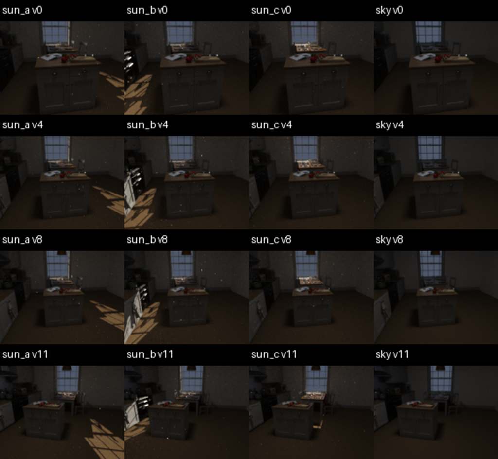
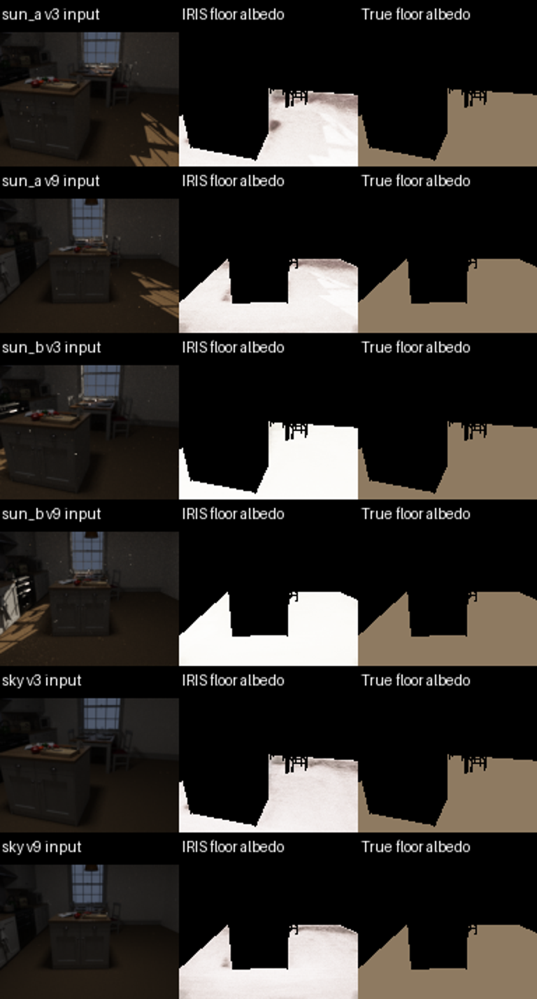
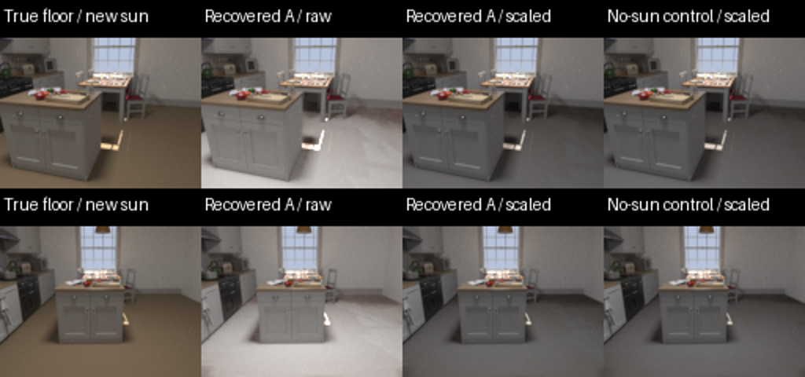

# EXP0019：太阳光斑是否被 IRIS 烘焙为浅色地板

## 问题与实验

固定厨房、相机、材质和室内灯，只改变窗外太阳方向。
如果真实均匀地板的恢复反照率跟随光斑位置变化，且无太阳对照在相同位置
没有同样差异，就得到本配置下光照污染材质的证据。
这不是验证所有强光，也不是尖锐镜面高光测试。

使用 Country Kitchen 原始几何、家具与窗户；替换地板为 IRIS 定义的
均匀哑光材质：RGB albedo=[0.28,0.20,0.12]、roughness=0.9、metallic=0。
其他材质保留作者定义；移除原代理面光源，增加固定可见的天花板小灯。
地板渲染器与原版 BaseBRDF 在 512 对方向上的最大绝对响应差约 2.24e-8。

14 个相机位置（12 训练、2 保留视角），128×96，1024 SPP，路径深度 8。
12 个相机看地板，另 2 个看灯具，为光源提取提供实际可见证据。
太阳 A/B 相对窗外方向方位 -25/+25°、高度均为 25°；C 方位 0°、高度 40°；
另有无直射太阳的 sky 对照。共 56 张 HDR 和对应 LDR，曝光固定。
A/B 分别单独训练，sky 单独训练，C 不用于训练。
C 的主要光斑落在桌面，地板直射较少，适合检查旧地板光斑能否消失。
太阳仍为平行光近似、天空为均匀 RGB，不是天气/有限太阳圆盘的真实仿真。

## 控制变量与权限边界

本实验属于 P1：使用同一已知几何与相机；不是仅从照片重建。
使用原版 IRIS 各阶段与损失，三组相同参数、随机种子和中性先验。
新数据没有 Irisformer 推理结果，用统一 0.5 中性 albedo 先验，因此不能称为
原论文默认配置复现。材质阶段 la=0，分割为全零占位，不提供真实材质分区。
CRF 输入由原版 Emor 默认曲线生成，避免相机响应差异成为主要干扰。
训练 SPP=32、子批=16，SLF 网格=128，最终显示渲染 SPP=64。
四个训练阶段分别限制 200 步，固定采用真实最终权重，不用 GT 验证分数选模型。

原始 SyntheticDatasetLDR 要求读取 DiffCol/Roughness/Emit 等字段；它们在地板
区域存有真值，其他区域为占位，不能用于全图 BRDF 指标。源码检查显示材质
GT 只用于日志/验证，本轮优化先验来自独立的中性图；GT 验证保存的 best 文件
不用于阶段交接或评估。仍是同目录可访问的受控实验，不宣称进程隔离盲测。

原版 IRIS 的环境未命中返回零辐射，不能显式表达本数据的太阳和天空。
这种光照表达限制正是需要检查的因素；本轮不把其影响误说成 BRDF 表达能力不足。

## 判据

主要指标为真实太阳可见的地板区域与阴影地板的恢复 albedo（RGB 均值）差。
掩膜向内腐蚀一个像素，至少 32 个受光与阴影像素才输出区域对比。
同时报告差值 / 全地板平均 albedo，以减弱整体光照—反照率尺度歧义。
对无太阳模型应用相同太阳 A/B 掩膜，计算上述差值的变化。
两个视角来自同一房间，不是两个独立样本；不做像素级显著性宣传。

附加物理重渲染：只替换地板为恢复材质，其他材质、几何与太阳 C 均用生成真值。
因此是使用真值的地板误差传播诊断，不是完整未知光照重渲染能力。
若报告尺度对齐版本，只在训练视角的非直射地板上用真 albedo 拟合单一尺度，
仅用于评估，不反馈训练，也不用保留太阳 C 图像拟合曝光。

## 执行中发现并修复的检查点错误

第一版虽然日志到达 200 步，但阶段交接的 `last.ckpt` 只含第 18 步权重。
核查本机 Lightning 2.6.6 的 ModelCheckpoint：默认保存路径仅在当步保存了
受监控的检查点时更新 last；训练结束也未无条件刷新已有 last。验证分数未改善时，
last 因而停留在早期步数。这里不是“没有运行训练”，而是交接了旧权重。
旧 `iris_sun_a`/`iris_sky`、中止的 `iris_sun_b` 和 `eval_sun_a` 不用于结论。

在 initialize.py、train_brdf_crf.py、train_emitter.py 的 trainer.fit 后显式
保存 `final.ckpt`；两个运行器改为交接该文件，并为后续运行增加步数断言。
`*_v2` 重新跑所有阶段，评估器拒绝低于 200 步的检查点。
修改只影响训练结束时保存和阶段交接，不修改损失、网络或渲染公式。

## 数据验收与限制

保留视角的地板没有过曝。不同光照的地板交点一致，几何/相机保持固定。
独立 seed101/202 的全地板 RGB RMSE / 平均 RGB 约 3%–9%，含光斑边界采样噪声；
这是一轮低分辨率因果诊断，不是高精度材质基准。
光斑 mask 使用第一遮挡测试，透明/折射路径不在此 mask 定义内。
未提供跨房间泛化、原论文默认先验、多个训练随机种子或预算收敛证据。
阳性结果只能说明该受控配置会出现污染，不能扩大为“所有 IRIS 场景都失败”。

## 资产许可

Country Kitchen by Jay-Artist，CC BY 3.0；由 Benedikt Bitterli 整理，
https://noobody.org/resources/ 。保留原作者资产署名；新地板材质和灯具为实验修改。

## 完成结果

三组均完成 12 阶段；9 个交接/最终 checkpoint 的 global_step 均为 200。
实际 IRIS 射线与生成地板交点的最大差约 2.04e-6 场景单位。
17 项已有测试通过；CPU 回归实验复现了 callback last=1、训练结束=3，
显式保存 final=3 且权重与内存模型一致，确认修复有效。

| 太阳条件 | 保留视角 | 扣除无太阳对照后的归一化光斑—阴影差 |
|---|---:|---:|
| A | 3 | +18.37 个百分点 |
| A | 9 | +13.98 个百分点 |
| B | 3 | 腐蚀后只有 1 个受光像素，不评分 |
| B | 9 | -0.62 个百分点，未复现正向局部污染 |

**结论：本配置在太阳 A 下出现了光斑被写入浅色地板的现象；太阳 B 没有复现同样的局部指标。**
不能只保留 A 就宣称所有情况均失败。B 约 90.5%/93.8% 的地板像素
平均 albedo 超过 0.95，整体输出接近上限；并非正确恢复了真实均匀棕色地板。
A/sky 的绝对反照率也偏大，约 0.59–0.62 的 RGB 平均绝对误差包含显著尺度/颜色偏差。

发光面审计：A/sky 各检测到真实灯具的 2 个三角面；B 检测到 48 个，
其中 46 个不在实际灯具范围，属于非发光表面被归为发光面。
两保留视角中地板像素被判发光的数量均为 0，因此 A 的地板现象不是直接
把地板标成发光面造成的。B 的额外光源提取是另一种混淆，需后续单独消融。

## 换光重渲染

完成原尺度和评估专用尺度对齐两套重渲染，各以 4096 SPP、两个独立种子生成。
仅替换地板，其他材质与太阳 C 为真值；512×512 世界坐标材质表近邻查询，
这引入约 1.2×1.6 cm（按场景单位为米估计）的离散化，不能称为原网络的精确连续渲染。

尺度对齐后，旧 A 光斑内部在新光照下的 HDR RMSE：

| 视角 | A 恢复材质 | 无太阳恢复材质，同一区域 |
|---|---:|---:|
| 3 | 0.007245 | 0.006594 |
| 9 | 0.007381 | 0.006762 |

旧 A 区域的平均有符号 RGB 残差约 +0.00208/+0.00197，无太阳对照约
-0.00055/-0.00073。与材质图证据方向一致，但结果仍混合颜色、粗糙度和离散化误差，
没有独立房间/训练种子置信区间，不能把这组数字当作广泛重渲染性能结论。

## 运行与文件入口

本地交互入口：`experiments/out/EXP0019_sunpatch/index.html`。
数据：`data_03/`；有效运行：`iris_sun_a_v2/`、`iris_sun_b_v2/`、`iris_sky_v2/`；
最终材质指标：`eval_02/report.json`；重渲染：`relight_01/`、`relight_aligned/`。
初次数据导出缺少 segmentation，占位字段已补齐且修复单独记录。
B 的监控状态文件停留在 running，但进程已不存在；12 阶段返回码、最终权重
和独立评估均通过，另写 reconciled_status.json，保留原监控文件，不伪造观测到的父进程退出码。

完整大文件保留在用户指定 `/home/minghao/projects/iris` 下；仓库只同步脚本、
日志、指标、源码与小图，不提交训练权重和整个数据集。

